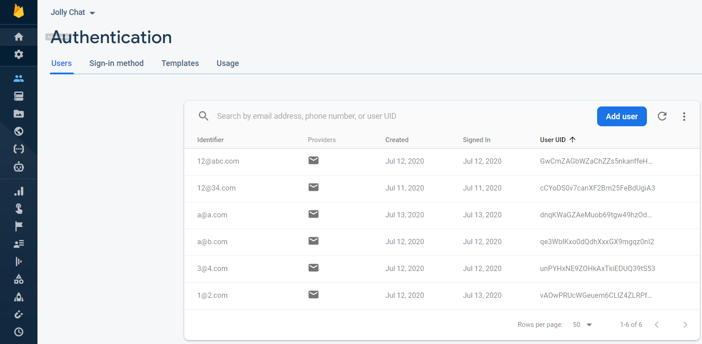
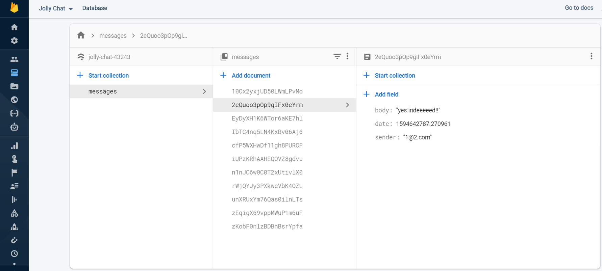

# Jolly-Chat
Jolly Chat is an internet-based instant messaging app. We utilized a service called Firebase Firestore as a back-end database to store and retrieve our messages from the cloud. This app was built following Angela's course on Udemy with some modifications.
 <tr>
 • GIF

 • Authentication  
    
  
  • Database  

